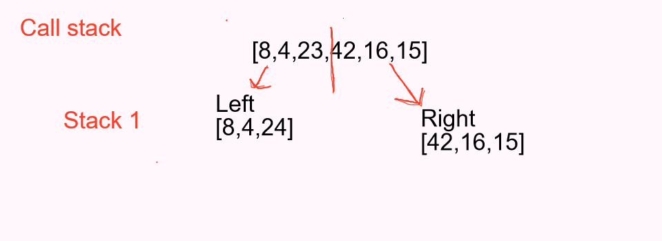
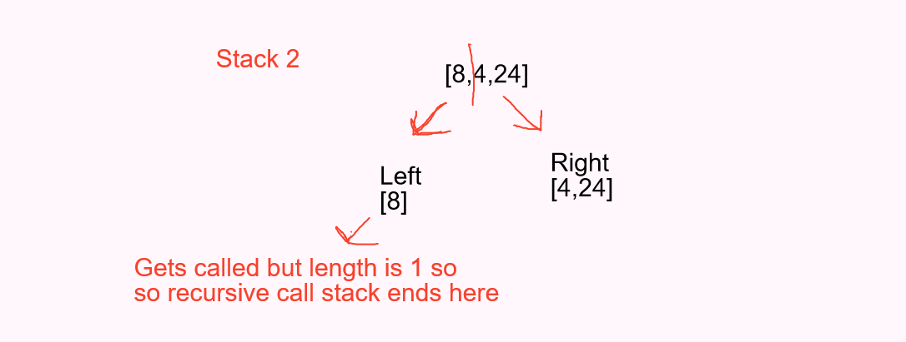
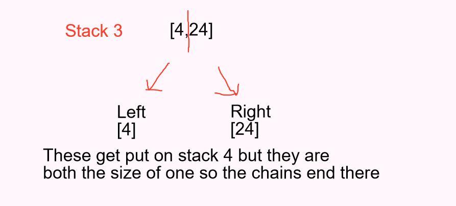
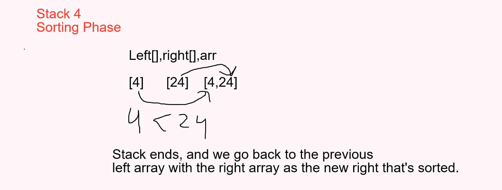

# Blog Post 2: Sorting

## Merge Sorting

A sorting algorithm that splits the taken in array into to half and recursively spliting down an array with one length, which then will cascade back up as each side get called into a helper function sorting the numbers out.

## Code

``` Java
public static void mergeSort(int[] arr){
    int n = arr.length;

    if(n>1){
      int mid = n/2;
      int[] left = Arrays.copyOfRange(arr,0,mid);
      int[] right = Arrays.copyOfRange(arr,mid ,n);

      mergeSort(left);
      mergeSort(right);

      merge(left,right,arr);
    }
  }

  private static void merge(int[] left, int[] right, int[] arr) {
    int i=0;
    int j=0;
    int k=0;

    while(i < left.length && j< right.length){
      if(left[i]<= right[j]){
        arr[k]=left[i];
        i++;
      }else{
        arr[k]=right[j];
        j++;
      }
      k++;
    }

    if(i==left.length){
      while (k< arr.length){
        arr[k]=right[j];
        j++;
        k++;
      }
    }else {
      while (k< arr.length){
        arr[k]=left[i];
        i++;
        k++;
      }
    }
  }
```

## Trace

Sample Array: [8,4,23,42,16,15]

**Pass 1:**


In the first stack we take the initial arr and cut it in half. We assign each half to a new arr called left and right. These are essentially temporary pointer holders. We then call the same function again but on the left arr, and the right arr, this is recursion. In the picture below will show that process once it gets to the base level of having an arr with the size of 1.


**Pass 2:**



**Pass 3:**


**Pass 4:**

This stack is when we reach the end of the recursion login, meaning now the  left and right side
are only of 1 length with the arr passed through being its original state before getting cut.
We use logic to sort which is less and put them in the appropriate spot, with an if checking for the coming cases of sorting unequal left and right arrays.


## Efficiency

**Time :** )

Time is o of n squared since we always will have to do two operations n number of times depending on the size of the array and having to constantly split it.

**Space :**  )
It will only take n space since we are just rearranging the same array.
