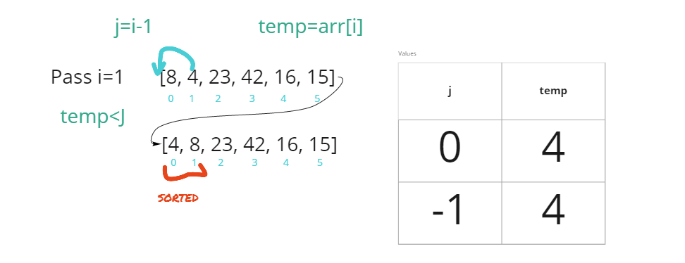
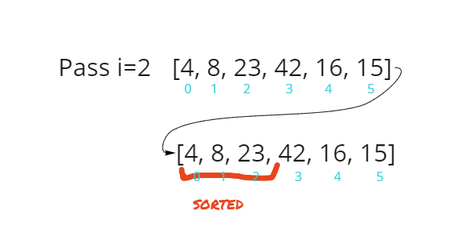
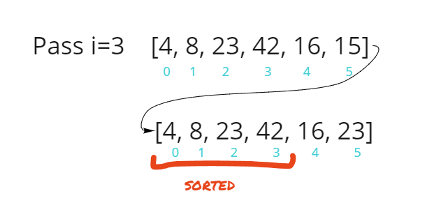
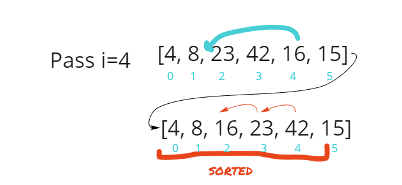
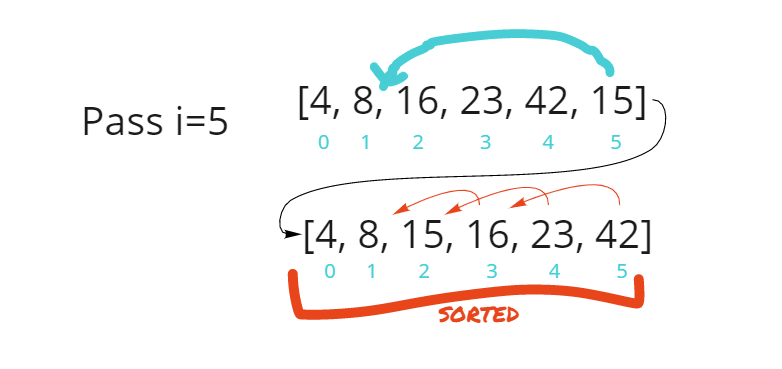

# Blog Post 1: Sorting

## Insertion Sorting

Insertion Sorting is sorting algorithm that traverses an array multiple times as it slowly track check when the selected index of the array is bigger than the spot before it and then insert the values of those two index swapped.

## Code

``` Java
  public void insertionSort(int[] arr){

    for(int i =1;i<arr.length;i++){

      int j = i-1;
      int temp = arr[i];

      while (j>=0 && temp<arr[j]){
        arr[j+1]=arr[j];
        j = j-1;
      }

      arr[j+1]=temp;
    }
  }
}
```


## Trace

Sample Array: [8,4,23,42,16,15]

**Pass 1:**


In the first pass, we have **j** as 0 and **temp** as 4. We set **i** in the for loop as 1 since our logic checks for the current position(**temp**) and the position before it(**j**), so we can't start **i** at 0 since the index of an array start at 0. Our comparison in said for loop covers the end of the array.

So both condition in the while loop are met, and it proceeds with our logic. So since current position is less than the spot before it, we get the array index at **j+1** since **j** is always the previous position and that will get us the spot ahead of it. Then assign that index spot the value of arr[**j**] which in this case is 8, so we swap the previous number since it's bigger than the current. Then subtract 1 off **j** which in turns make's **j**=-1, and now it breaks out of the while loop. We know now that j is -1 outside the while loop which means the values our sort, and we set arr[**j**+1],which is equals to 0, to the value of the temp, which is 4.


**Pass 2:**

Pass two will now do nothing but assign the same value as it's own since it's all sorted out. The nest passes will go over the same logic as we did in pass 1 but will place the smaller number before the bigger.


**Pass 3:**


**Pass 4:**



**Pass 5:**


**Pass 6**:
End of for loop and function. Array is now sorted.


## Efficiency

**Time :** )

Time is o of n squared since we always will have to do two operations n number of times depending on the size of the array.

**Space :**  )
It will only take one space since we are just rearranging the same array.
