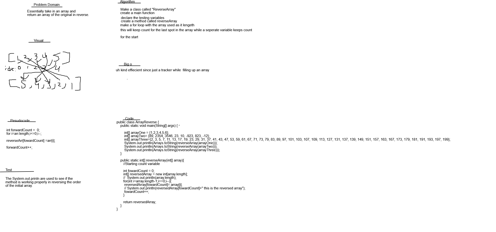
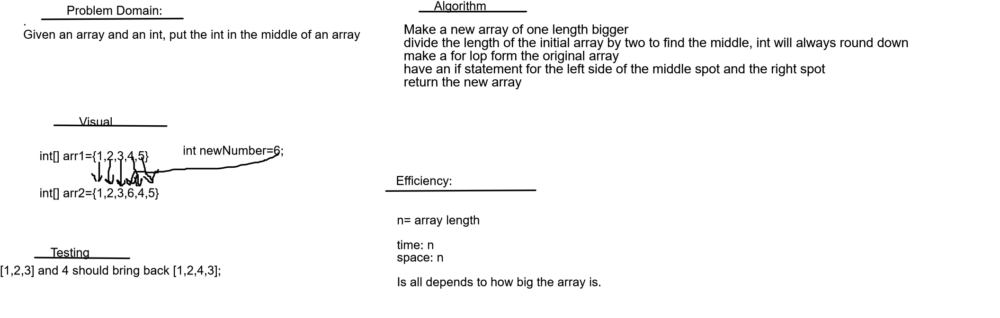
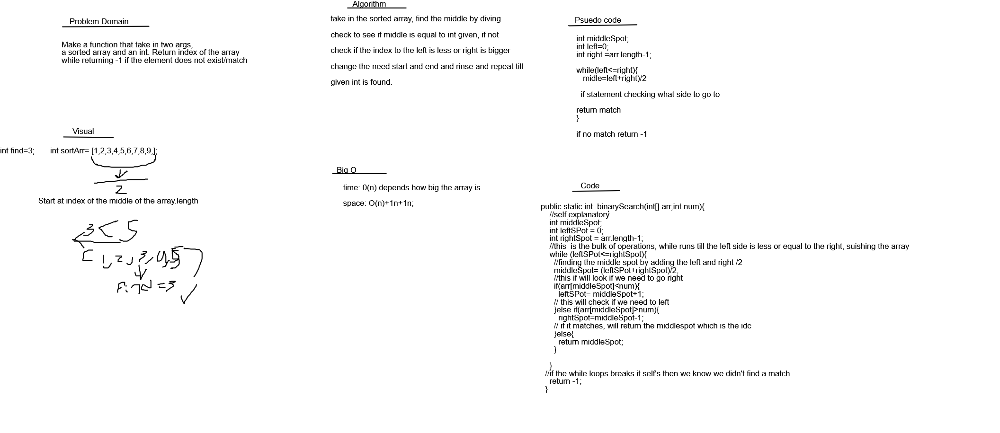
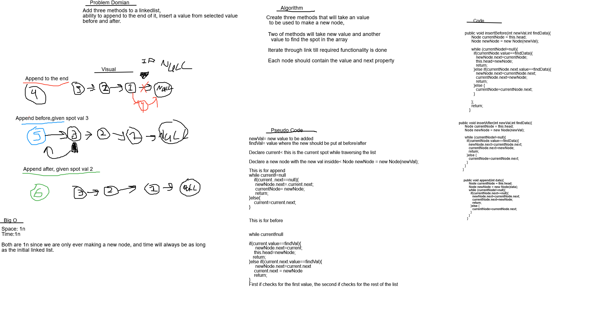
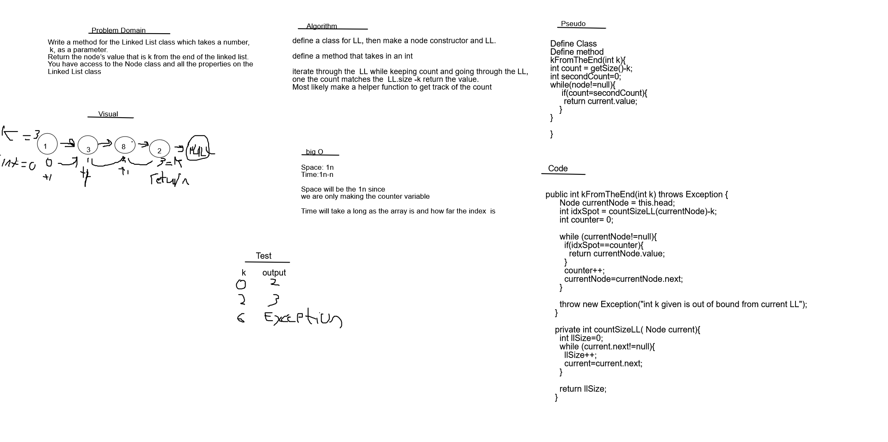
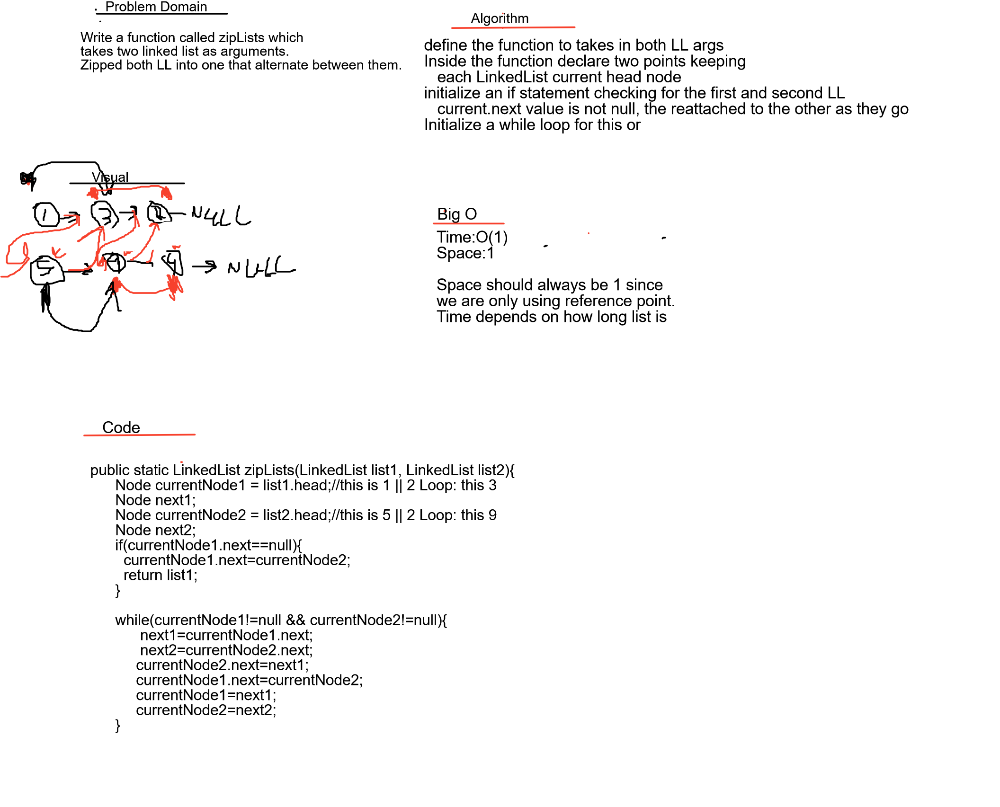
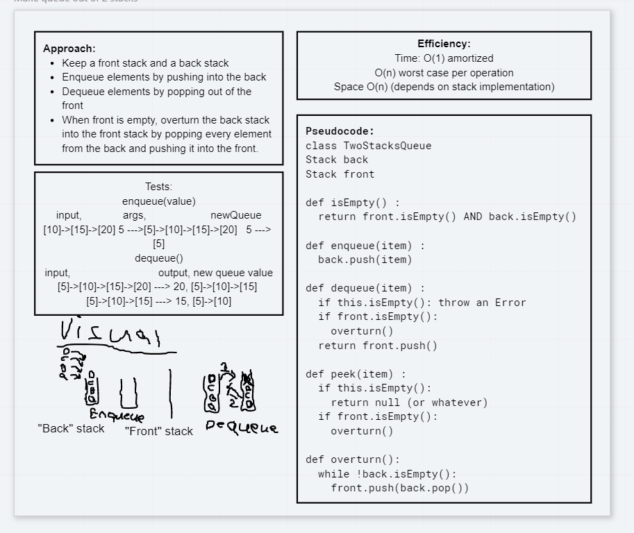
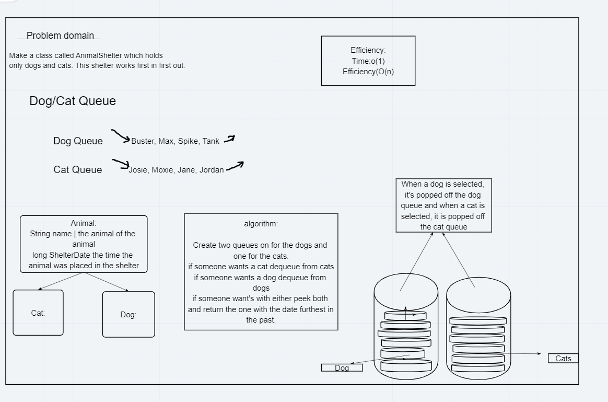

# Data Structures and Algorithms

## Language: `Java`

### Reverse an Array

Take in an array and then return it in reversed order.

#### Challenge

Write a function called reverseArray which takes an array as an argument. Without utilizing any of the built-in methods available to your language, return an array with elements in reversed order.

#### Approach & Efficiency

I took a for a loop approach while filling up a new array, as for the big 0 idk, fast i  guess?

#### Solution

# ####################################################################  

### Add a value into the middle of an array  

Puts something in the middle of arrray.  

#### Challenge  

Write a function called insertShiftArray which takes in an array and the value to be added.  

#### Approach & Efficiency  

It's efficient as it wil get, depends on how big the array is that gets put in the args  

#### Solution  

  

# ####################################################################

### Finding a Matching value using binary search

Find the matching int in an array using binary search technique.

#### Challenge  

Write a function called BinarySearch which takes in 2 parameters: a sorted array and the search key. Without utilizing any of the built-in methods available to your language, return the index of the array’s element that is equal to the search key, or -1 if the element.  

#### Approach & Efficiency  

The time needed to take scales with the space as it depends how big the array is, but the efficiency is insane since it take less steps to find the matching number than in an for loop.

#### Solution

  

# ########################################################################  

### Singly Linked List  
Making a new linked list, with several methods of testing and reading.  

#### Challenge  

 Define a method called insert which takes any value as an argument and adds a new node with that value to the head of the list with an O(1) Time performance.  
 Define a method called includes which takes any value as an argument and returns a boolean result depending on whether that value exists as a Node’s value somewhere within the list.  
 Define a method called toString (or __str__ in Python) which takes in no arguments and returns a string representing all the values in the Linked List, formatted as:
        "{ a } -> { b } -> { c } -> NULL"  

#### Approach & Efficiency  

<!-- What approach did you take? Why? What is the Big O space/time for this approach? -->
I just made a linklist and node class which will generate a new linklist, from there you able to use the methods to add new nodes to the list. Big o is 1 while space is 1 as well.

#### API  

nada()- This will check if your new linklist is empty.  

insert(int data)- this will insert your values into your fully form linklist. Warn, this will add the node to the beginning of the list! so you last insertion will always be first in the list.

printNode()- this will return a str that contains all your linkedlist values

toString()- will return a str of all the values in a fancy way

includes(int num)-will check if a certain values is inside the linkedlist and return a boolean.

firstNode()- will return the first value of your linked list  

# ####################################################################  

### Append to the end,Insert before and after in a LinkedList 

.append(int val)==>This will append a value to the end of a linkedlist

.insertBefore(int val,int findSpot)==> this will insert the val before the findSpot in the linked list

.insertAfter(int val,int findSpot)==> this will insert the val after the findSpot in the linked list

#### Challenge  

Write the following methods for the Linked List class:

    .append(value) which adds a new node with the given value to the end of the list
    .insertBefore(value, newVal) which add a new node with the given newValue immediately before the first value node
    .insertAfter(value, newVal) which add a new node with the given newValue immediately after the first value node

#### Approach & Efficiency  

Effieciency is 1n, it all depends on how big the LinkedList is, approach i took if just an iriterate while loop.

#### Solution  

  

# ####################################################################  

### Find value that's k from the end of an LL

.kFromTheEnd(int k)==> return the value from the node that k from the end of LL.

#### Challenge  

Write a method for the Linked List class which takes a number, k, as a parameter. Return the node’s value that is k from the end of the linked list.  

#### Approach & Efficiency  

Effieciency is 2n for time, cause we have to go through the loop twice. 1n+1n for space since  we only make two variables

#### Solution  

  

# ####################################################################  

### Merged two Linkedlist at alternating spots so they become into one linklist  

zipLists(LinkedList list, LinkedList list2)==> will merges two linked list into one and return the merge one, warning the first list in the args will always go first in the alternation 
and it will rearrange your second list as well since it just returns the first list. Kinda redudant but hey its what the challenge asked

#### Challenge  

Write a function called zipLists which takes two linked lists as arguments. Zip the two linked lists together into one so that the nodes alternate between the two lists and return a reference to the head of the zipped list.  

#### Approach & Efficiency  

Effieciency is n for time, cause we have to go through a  while loop. O(1) for space since  we only make have one operation running

#### Solution  

  

# ####################################################################  

### Stacks and Queues  
<!-- Short summary or background information -->
Learning new data structure and there methods.
#### Challenge
<!-- Description of the challenge -->
Create a Stack And Queue class while using a Node class to meet the needs of each data structure. Then make the require methods to come with each type.
#### Approach & Efficiency
<!-- What approach did you take? Why? What is the Big O space/time for this approach? -->
Declare a node taking in generic type, one constructor being used for the stack while the other constructor being use for the queue.
#### API
<!-- Description of each method publicly available to your Stack and Queue-->

##### Stack  

push(T value)==> will push whatever value you put inside the args into your Stack.  

pop()==> will remove the top of the stack and return you the value of it  

# ####################################################################  

### Make a queue using 2 stacks  

Make a queue data structure using stacks.

#### Challenge  

Create a brand new PseudoQueue class. Do not use an existing Queue. Instead, this PseudoQueue class will implement our standard queue interface (the two methods listed below), but will internally only utilize 2 Stack objects.

#### Approach & Efficiency  

Effieciency is n for time, cause we have to go through a  while loop. O(1) for space since  we only make have one operation running

#### Solution  

  

# ####################################################################  

### Make An animal shelters using queues  

First-in, First out Animal Shelter.

#### Challenge  

Create a class called AnimalShelter which holds only dogs and cats. The shelter operates using a first-in, first-out approach.
Implement the following methods:
    enqueue(animal): adds animal to the shelter. animal can be either a dog or a cat object.
    dequeue(pref): returns either a dog or a cat. If pref is not "dog" or "cat" then return null.

#### Approach & Efficiency  

Effieciency is o1 for time, cause it will always either add a thing or remove a thing. O(n) for space effiecency since gave to make stacks.

#### Solution  

  
