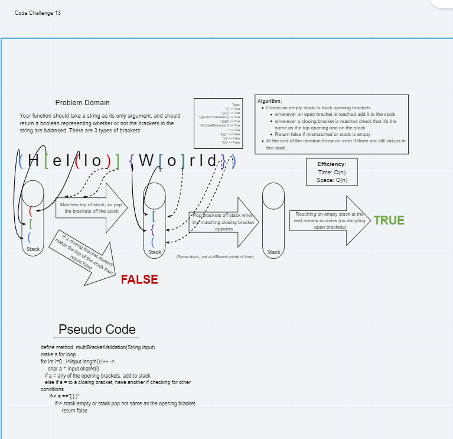
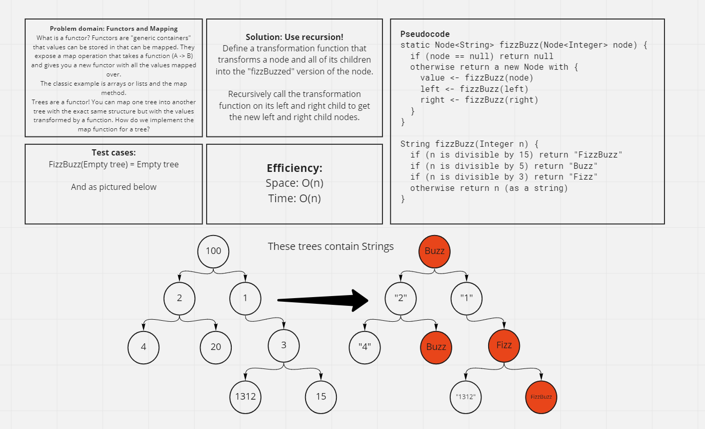
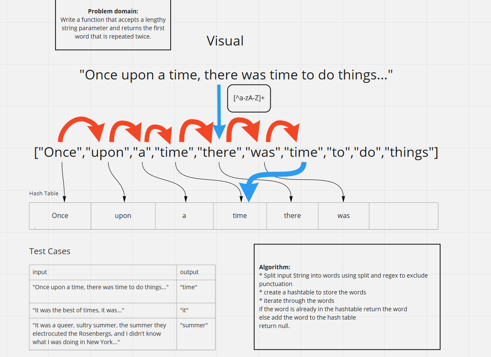
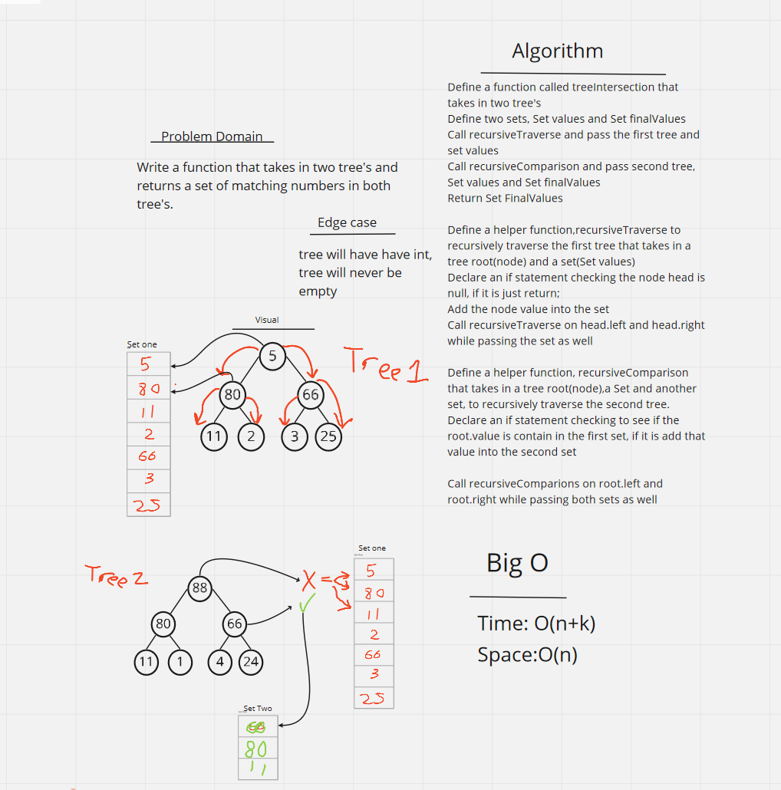
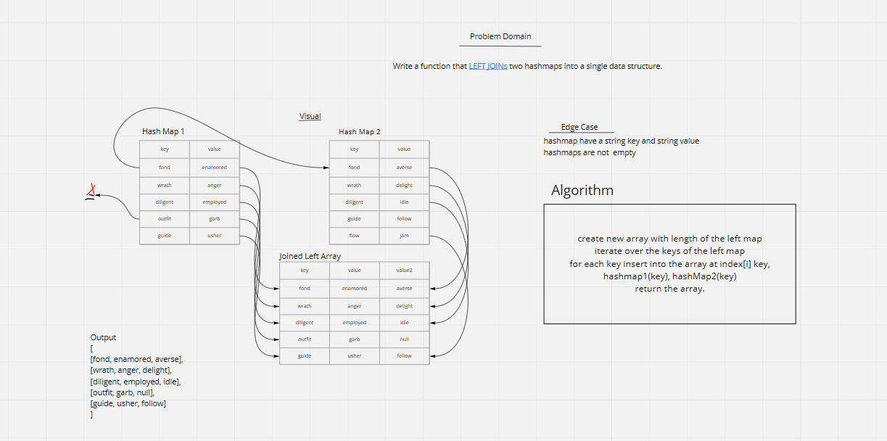
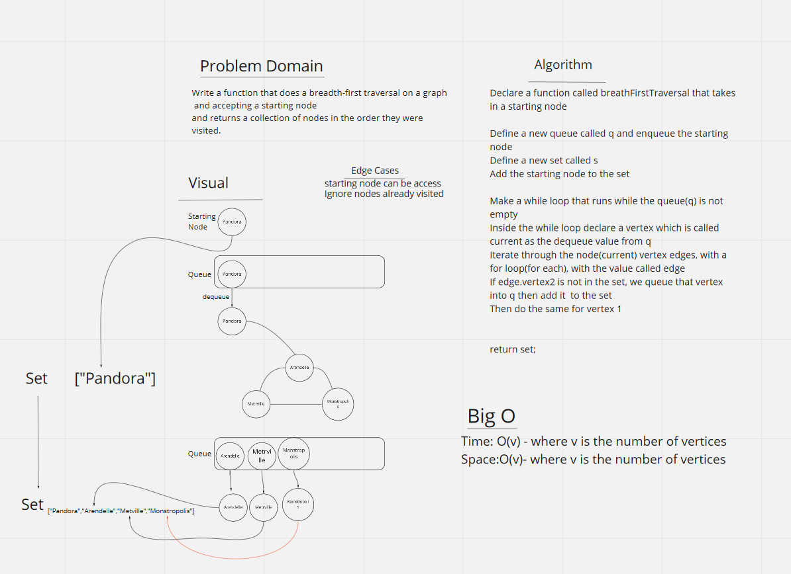

# Data Structures and Algorithms

## Language: `Java`

### Reverse an Array

Take in an array and then return it in reversed order.

#### Challenge

Write a function called reverseArray which takes an array as an argument. Without utilizing any of the built-in methods available to your language, return an array with elements in reversed order.

#### Approach & Efficiency

I took a for a loop approach while filling up a new array, as for the big 0 idk, fast i  guess?

#### Solution

# ####################################################################

### Add a value into the middle of an array

Puts something in the middle of arrray.

#### Challenge

Write a function called insertShiftArray which takes in an array and the value to be added.

#### Approach & Efficiency

It's efficient as it wil get, depends on how big the array is that gets put in the args

#### Solution

# ####################################################################

### Finding a Matching value using binary search

Find the matching int in an array using binary search technique.

#### Challenge

Write a function called BinarySearch which takes in 2 parameters: a sorted array and the search key. Without utilizing any of the built-in methods available to your language, return the index of the array’s element that is equal to the search key, or -1 if the element.

#### Approach & Efficiency

The time needed to take scales with the space as it depends how big the array is, but the efficiency is insane since it take less steps to find the matching number than in an for loop.

#### Solution

# ########################################################################

### Singly Linked List
Making a new linked list, with several methods of testing and reading.

#### Challenge

 Define a method called insert which takes any value as an argument and adds a new node with that value to the head of the list with an O(1) Time performance.
 Define a method called includes which takes any value as an argument and returns a boolean result depending on whether that value exists as a Node’s value somewhere within the list.
 Define a method called toString (or __str__ in Python) which takes in no arguments and returns a string representing all the values in the Linked List, formatted as:
        "{ a } -> { b } -> { c } -> NULL"

#### Approach & Efficiency

<!-- What approach did you take? Why? What is the Big O space/time for this approach? -->
I just made a linklist and node class which will generate a new linklist, from there you able to use the methods to add new nodes to the list. Big o is 1 while space is 1 as well.

#### API

nada()- This will check if your new linklist is empty.

insert(int data)- this will insert your values into your fully form linklist. Warn, this will add the node to the beginning of the list! so you last insertion will always be first in the list.

printNode()- this will return a str that contains all your linkedlist values

toString()- will return a str of all the values in a fancy way

includes(int num)-will check if a certain values is inside the linkedlist and return a boolean.

firstNode()- will return the first value of your linked list

# ####################################################################

### Append to the end,Insert before and after in a LinkedList

.append(int val)==>This will append a value to the end of a linkedlist

.insertBefore(int val,int findSpot)==> this will insert the val before the findSpot in the linked list

.insertAfter(int val,int findSpot)==> this will insert the val after the findSpot in the linked list

#### Challenge

Write the following methods for the Linked List class:

    .append(value) which adds a new node with the given value to the end of the list
    .insertBefore(value, newVal) which add a new node with the given newValue immediately before the first value node
    .insertAfter(value, newVal) which add a new node with the given newValue immediately after the first value node

#### Approach & Efficiency

Effieciency is 1n, it all depends on how big the LinkedList is, approach i took if just an iriterate while loop.

#### Solution

# ####################################################################

### Find value that's k from the end of an LL

.kFromTheEnd(int k)==> return the value from the node that k from the end of LL.

#### Challenge

Write a method for the Linked List class which takes a number, k, as a parameter. Return the node’s value that is k from the end of the linked list.

#### Approach & Efficiency

Effieciency is 2n for time, cause we have to go through the loop twice. 1n+1n for space since  we only make two variables

#### Solution

# ####################################################################

### Merged two Linkedlist at alternating spots so they become into one linklist

zipLists(LinkedList list, LinkedList list2)==> will merges two linked list into one and return the merge one, warning the first list in the args will always go first in the alternation
and it will rearrange your second list as well since it just returns the first list. Kinda redudant but hey its what the challenge asked

#### Challenge

Write a function called zipLists which takes two linked lists as arguments. Zip the two linked lists together into one so that the nodes alternate between the two lists and return a reference to the head of the zipped list.

#### Approach & Efficiency

Effieciency is n for time, cause we have to go through a  while loop. O(1) for space since  we only make have one operation running

#### Solution

# ####################################################################

## Stacks and Queues
<!-- Short summary or background information -->
Learning new data structure and there methods.
#### Challenge
<!-- Description of the challenge -->
Create a Stack And Queue class while using a Node class to meet the needs of each data structure. Then make the require methods to come with each type.
#### Approach & Efficiency
<!-- What approach did you take? Why? What is the Big O space/time for this approach? -->
Declare a node taking in generic type, one constructor being used for the stack while the other constructor being use for the queue.
#### API
<!-- Description of each method publicly available to your Stack and Queue-->

##### Stack

push(T value)==> will push whatever value you put inside the args into your Stack.

pop()==> will remove the top of the stack and return you the value of it

# ####################################################################

### Make a queue using 2 stacks

Make a queue data structure using stacks.

#### Challenge

Create a brand new PseudoQueue class. Do not use an existing Queue. Instead, this PseudoQueue class will implement our standard queue interface (the two methods listed below), but will internally only utilize 2 Stack objects.

#### Approach & Efficiency

Effieciency is n for time, cause we have to go through a  while loop. O(1) for space since  we only make have one operation running

#### Solution

# ####################################################################

### Make An animal shelters using queues

First-in, First out Animal Shelter.

#### Challenge

Create a class called AnimalShelter which holds only dogs and cats. The shelter operates using a first-in, first-out approach.
Implement the following methods:
    enqueue(animal): adds animal to the shelter. animal can be either a dog or a cat object.
    dequeue(pref): returns either a dog or a cat. If pref is not "dog" or "cat" then return null.

#### Approach & Efficiency

Effieciency is o1 for time, cause it will always either add a thing or remove a thing. O(n) for space effiecency since gave to make stacks.

#### Solution

# ####################################################################

### Make A Complete bracket validation

Validate if a string has a complete set of brackets.

#### Challenge

Your function should take a string as its only argument, and should return a boolean representing whether or not the brackets in the string are balanced. There are 3 types of brackets:

    Round Brackets : ()
    Square Brackets : []
    Curly Brackets : {}

#### Approach & Efficiency

Time is O(n) since there's only one operation being run.

Space O(n) since we make a stacl that at most will be empty but filled with the matching brackets, no matter how many there are.

#### Solution

# ####################################################################

## Trees
<!-- Short summary or background information -->
Make a tree and a binary search tree
## Challenge
<!-- Description of the challenge -->

    Create a Node class that has properties for the value stored in the node, the left child node, and the right child node.
    Create a BinaryTree class
        Define a method for each of the depth first traversals called preOrder, inOrder, and postOrder which returns an array of the values, ordered appropriately.

    Any exceptions or errors that come from your code should be semantic, capturable errors. For example, rather than a default error thrown by your language, your code should raise/throw a custom, semantic error that describes what went wrong in calling the methods you wrote for this lab.
    Create a BinarySearchTree class
        Define a method named add that accepts a value, and adds a new node with that value in the correct location in the binary search tree.
        Define a method named contains that accepts a value, and returns a boolean indicating whether or not the value is in the tree at least once.

## Approach & Efficiency
<!-- What approach did you take? Why? What is the Big O space/time for this approach? -->
Used recursive for all the depth traversalls methods. then iteration for the add and contains in the binary tree one
## API
<!-- Description of each method publicly available in each of your trees -->
preOrder
inOrder
postOrder

# ####################################################################

###   Fizz Buzz Tree

Write a function called FizzBuzzTree which takes a k-ary tree as an argument.

#### Challenge

Without utilizing any of the built-in methods available to your language, determine whether or not the value of each node is divisible by 3, 5 or both. Create a new tree with the same structure as the original, but the values modified as follows:

    If the value is divisible by 3, replace the value with “Fizz”
    If the value is divisible by 5, replace the value with “Buzz”
    If the value is divisible by 3 and 5, replace the value with “FizzBuzz”
    If the value is not divisible by 3 or 5, simply turn the number into a String.

Return a new tree.

#### Approach & Efficiency

Time is O(n) since there's only one operation being run.

Space O(n) since we=it will keep calling operation depending on how many nodes are in the tree.

#### Solution

# ##################################

## Hash Tables
Hash Table are essentially a way of storing key value pairs which two keys ever being the same.The way I implemented this hash set is by using buckets with the set being initialized with its size. This means the hashset will have that many buckets, and each bucket is a Linked List with the value of each node being an object holding the key and the value.

#### Challenge
Implement a Hashtable with the following methods:

    add: takes in both the key and value. This method should hash the key, and add the key and value pair to the table, handling collisions as needed.
    get: takes in the key and returns the value from the table.
    contains: takes in the key and returns a boolean, indicating if the key exists in the table already.
    hash: takes in an arbitrary key and returns an index in the collection.

#### Approach & Efficiency
Used an arraylist with each index holding an arraylist which then each node in the arraylist holding an object with the key and value property.

#### API
yourHashTable.add(key,value)- this will add your key and value into the hash set.

yourHashTable.get(key)- this will return the value paired with the inputted key. If no match found, it will return null.

yourHashTable.contains(key)- this will look to see if your hashtable contains the key and return true, if not it will return false.

# ####################################################################

### Repeated Word
Find your most repeated word!

### Challenge Description

    Write a function that accepts a lengthy string parameter.
    Without utilizing any of the built-in library methods available to your language, return the first word to occur more than once in that provided string.

###  Approach And Efficiency
Time:O(n)- Depends on how long the string is.
Space:0(2n)- There were only be two operation

### Solution

# ####################################################################

### Tree Intersection
Find the matching numbers in two tree's!

### Challenge Description

    Write a function called tree_intersection that takes two binary tree parameters.
    Without utilizing any of the built-in library methods available to your language, return a set of values found in both trees.

###  Approach And Efficiency
Time:O(n+k)- The time will take n times for traversing the tree and plus k, where k the time it takes to check the set for mathcing numbers

Space:0(2n)- Only two sets are ever made with each size depending on the nodes of the tree's

### Solution

# ####################################################################

### Left Join
Return an output that's similar to what LEFT JOIN does in SQL.

### Challenge Description

    Write a function that LEFT JOINs two hashmaps into a single data structure.
    The first parameter is a hashmap that has word strings as keys, and a synonym of the key as values.
    The second parameter is a hashmap that has word strings as keys, and antonyms of the key as values.
    Combine the key and corresponding values (if they exist) into a new data structure according to LEFT JOIN logic.
    LEFT JOIN means all the values in the first hashmap are returned, and if values exist in the “right” hashmap, they are appended to the result row. If no values exist in the right hashmap, then some flavor of NULL should be appended to the result row.
    The returned data structure that holds the results is up to you. It doesn’t need to exactly match the output below, so long as it achieves the LEFT JOIN logic.
    Avoid utilizing any of the library methods available to your language.

###  Approach And Efficiency
Time:O(n)- This will only take n times where n is the size of the first hasmap

Space:0(n^2)- We only make the space depending how long the first hasmap is

### Solution

# ####################################################################

## Graph
A graph is a collection of data linked up together through relations. Each relation can also have a weight attached to it.

#### Challenge
Implement your own Graph. The graph should be represented as an adjacency list, and should include the following methods:

    AddNode()
        Adds a new node to the graph
        Takes in the value of that node
        Returns the added node
    AddEdge()
        Adds a new edge between two nodes in the graph
        Include the ability to have a “weight”
        Takes in the two nodes to be connected by the edge
            Both nodes should already be in the Graph
    GetNodes()
        Returns all of the nodes in the graph as a collection (set, list, or similar)
    GetNeighbors()
        Returns a collection of edges connected to the given node
        Takes in a given node
        Include the weight of the connection in the returned collection
    Size()
        Returns the total number of nodes in the graph

#### Approach & Efficiency
Using an array list to holder both the vertices and edges, also making a class for the vertex and Edge.

#### API
addNode(value)-> takes in any values and add it to the graph

addEdge(vertex 1 , vertex 2)-> takes in two vertex's and make an edge between them, a relationship

# ####################################################################

###  Breadth-first traversal on a graph
Implement a breadth-first traversal on a graph.

### Challenge Description

Extend your graph object with a breadth-first traversal method that accepts a starting node. Without utilizing any of the built-in methods available to your language, return a collection of nodes in the order they were visited. Display the collection.

###  Approach And Efficiency
Time: O(v) - where v is the number of vertices
Space:O(v)- where v is the number of vertices

### Solution

# ##################################

## Blog Post

[Sort](./BlogPost/Sort.md)

[Merge Sort](./BlogPost/MergeSort.md)

